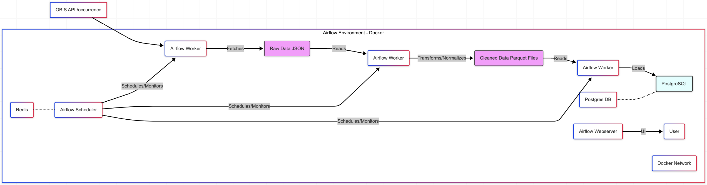
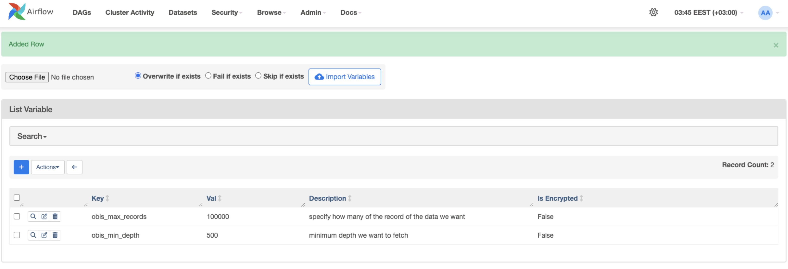
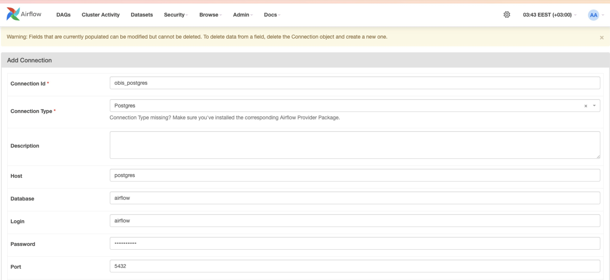

# OBIS Deep Sea ETL Pipeline with Airflow

## Overview

This project implements an end-to-end ETL (Extract, Transform, Load) pipeline to process deep-sea marine organism occurrence data from the Ocean Biodiversity Information System (OBIS). The pipeline fetches data via the OBIS API, performs cleaning, validation, and normalization using Python and Polars, loads the structured data into a normalized PostgreSQL schema, and orchestrates the entire workflow using Apache Airflow running on Docker.

This serves as a portfolio project demonstrating skills in:
* Data pipeline design and orchestration (Airflow)
* API data extraction and pagination (Requests, Python)
* Data transformation and cleaning (Polars, Python)
* Database schema design (Normalization)
* Data loading into relational databases (PostgreSQL)
* Infrastructure setup using containerization (Docker, Docker Compose)
* Environment configuration and dependency management

## Architecture (Conceptual)


- Extraction: Airflow task calls Python function to fetch data via OBIS API and saves raw JSON to a shared volume (`/opt/airflow/store/`).
- Transformation: Airflow task calls Python function to read raw JSON, clean, validate, impute, enrich, deduplicate (occurrenceID), normalize into dimension/fact DataFrames (using `Polars`), and save separate `Parquet` files to shared volume.
- Loading: Airflow task calls Python functions to:
    - Ensure normalized schema (dimension & fact tables with PKs/FKs) exists in PostgreSQL using definitions from obis_schema.py.
    - Load data from Parquet files into corresponding PostgreSQL tables (dimensions first, then facts). Uses a 'replace' strategy by default for simplicity.
- Orchestration: Airflow DAG defines tasks, dependencies, scheduling, and uses Airflow Variables/Connections.
- Data Quality: A final task performs basic row count checks on loaded tables.

## Data Source

- API: Ocean Biodiversity Information System (OBIS) v3 API /occurrence endpoint (https://api.obis.org/v3/)
- Filtering: Primarily filtered by minimum depth (startdepth, default >= 1000m) via API parameters configured in Airflow Variables.
- Pagination: Uses cursor-based pagination (size and after parameters).
- Data: Retrieves occurrence records including taxonomic, geographic, temporal, and record-specific metadata. Source data may contain duplicate `occurrenceIDs`, which are handled during transformation.

## Technologies used

| Technology       |                                                           Logo                              | Description                                  |
|-------------------|---------------------------------------------------------------------------------------------|----------------------------------------------|
| Docker           |                  | A platform for containerization, allowing us to package and deploy applications efficiently. Each component can runs in an isolated container, ensuring flexibility, scalability, and simplified maintenance.  |
| Python v3.10+ |   | A versatile, high-level programming language known for its simplicity and readability, used for web development, data analysis, and automation.        |
| Apache Airflow         |         | An open-source workflow orchestration tool for programmatically scheduling and monitoring tasks in data pipelines using Directed Acyclic Graphs (DAGs)         |
| PostgreSQL         |           | An advanced open-source relational database system supporting both SQL and JSON queries, known for reliability and scalability            |
| Polars          |  | A high-performance DataFrame library written in Rust for Python, designed for fast data manipulation and analysis of large datasets  |

## Project structured

```bash
sea_creatures/
├── dags/
│   ├── scripts/
│   │   ├── __init__.py           # Important for imports
│   │   ├── obis_etl_functions.py # Main E, T, L orchestrators & helpers
│   │   ├── obis_normalization.py # Dimension/Fact extraction logic
│   │   ├── obis_db_operations.py # Individual table loading logic
│   │   └── obis_schema.py        # SQL DDL strings as Python vars
│   └── obis_pipeline_dag.py    # Airflow DAG definition
├── store/                        # Intermediate data (JSON, Parquet) - created by DAG
├── docker-compose.yaml         # Docker Compose setup for Airflow & DBs | Directly from AirFlow official website
├── .env                          # Environment config (PIP packages, DB Passwords, UI Login)
└── README.md  
```    

## Setup & Installation
1. Prerequisites
    - Install Docker Desktop or Docker Engine + Compose.
    - Ensure Docker daemon is running.
    - Git

2. Clone Repository
    ```bash
    git clone https://github.com/toto-thi/obis_etl_pipeline
    cd sea_creatures
    ```

3. Configure Environment (`.env` file)
    - Create/edit `.env` file in the project root
    - Set a Passwords
    - Ensure `_PIP_ADDITIONAL_REQUIREMENTS` includes all necessary packages
    ```dotenv
    # .env Example
    # AIRFLOW_UID=...

    _PIP_ADDITIONAL_REQUIREMENTS=psycopg2-binary sqlalchemy requests polars connectorx apache-airflow-providers-postgres pyarrow pandas # Add all needed

    POSTGRES_USER=airflow
    POSTGRES_PASSWORD=your_secure_pg_password 
    POSTGRES_DB=airflow

    AIRFLOW_WWW_USER=airflow_admin 
    AIRFLOW_WWW_PASSWORD=your_secure_ui_password

    AIRFLOW__EMAIL__EMAIL_BACKEND= airflow.utils.email.send_email_smtp
    AIRFLOW__SMTP__SMTP_HOST=smtp.gmail.com
    AIRFLOW__SMTP__SMTP_USER=your_email@gmail.com
    AIRFLOW__SMTP__SMTP_PASSWORD=16-character password <FROM App Password in step 6>
    AIRFLOW__SMTP__SMTP_MAIL_FROM=your_email@gmail.com 
    ```

4. Build & Start the service
    Run from the project root:
    ```bash
    docker compose down -v && docker compose up -d
    ```
    *(Wait for services to initialize).*

5. Configure AirFlow UI
    - Open `http://localhost:8080`. Log in (user/pass from `.env`).
    - Admin -> Variables: Create `obis_min_depth` (e.g., 1000) and `obis_max_records` (e.g., 5000).
    
    - Admin -> Connections: Verify/Edit `obis_postgres` (Host=`postgres`, Port=`5432`, Schema=`airflow`, Login/Pass from `.env`). 
    

6. SMTP setup (we use Google)
    - Enable 2-Step Verification is ON for your Google Account: [https://myaccount.google.com/signinoptions/two-step-verification](https://myaccount.google.com/signinoptions/two-step-verification) (This is required).
    - Generate App Password: Go to the App Passwords page: [https://myaccount.google.com/apppasswords](https://myaccount.google.com/apppasswords) (You may need to sign in again).
        - Enter a descriptive name (e.g., "Airflow Docker OBIS Pipeline") and click **Generate**.
        - Google will display a **16-character password** in a yellow bar. **Copy this password immediately and save it securely.** It will not be shown again.

## Usage
1. Access Airflow UI: `http://localhost:8080`. Log in.
2. Find DAG: Locate `obis_deep_sea_normalized_etl`.
3. Enable DAG: Ensure the DAG is toggled "On" (unpaused).
4. Manual Trigger (Optional): Click "Play" (▶️) -> "Trigger DAG".
5. Monitor: Use "Grid" or "Graph" views. Check task logs.
6. Verify Output: Check PostgreSQL (`localhost:5432`) for `fact_occurrences`, `dim_* tables`. Intermediate files are in the local `store/ directory`.
7. Configure Run Parameters: Adjust fetch scope via Airflow Variables (`obis_min_depth`, `obis_max_records`).

## Scheduling
DAG can use Cron Presets.
- Current Schedule: By default, this DAG is set to run manually.
- Cron Presets: Easy-to-read presets for common intervals.
    - `@daily`: Run once a day at midnight UTC (00:00).
    - `@weekly`: Run once a week at midnight UTC on Sunday morning.
    - `@monthly`: Run once a month at midnight UTC on the morning of the 1st.
    - `@hourly`: Run once an hour at the beginning of the hour.
- Cron Expressions: For more specific schedules (e.g., run at 2:30 AM every Tuesday). Syntax: `minute hour day_of_month month day_of_week`.
    - Example: `30 2 * * 2` (2:30 AM every Tuesday)
    - Example: `0 5 * * *` (5:00 AM every day)

### Alerting
* **Configuration:** The DAG is configured to send email notifications on task failure using a custom Python callback function (`failure_email`).
* **Setup:** Relies on the SMTP connection (`smtp_conn` or `smtp_default`) configured in the Airflow UI (see Setup step 6).
* **Recipient:** The recipient email address is currently set within the DAG file (`obis_pipeline_dag.py` -> `RECEPIENT` variable). For more flexibility, this could be configured using an Airflow Variable.

## Note
If you want to make a scheduling, please modify the SQL schema as you wish before proceed (if needed), but I have handled it in the `obis_etl_functions.py` for appending new data everytime this DAG is executed.
